This is the .md file that documents all the steps

This is the Master ip address as shown underlined below

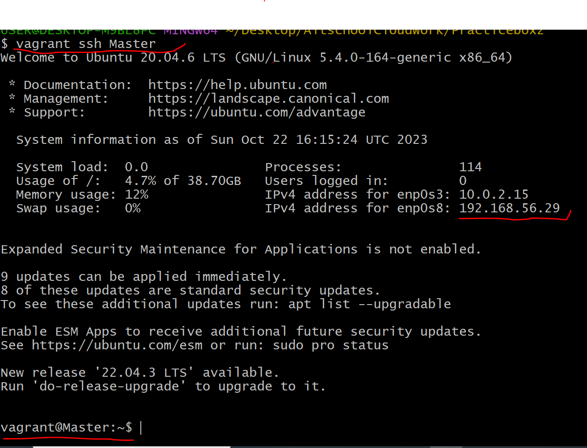

This is the Slave ip address 

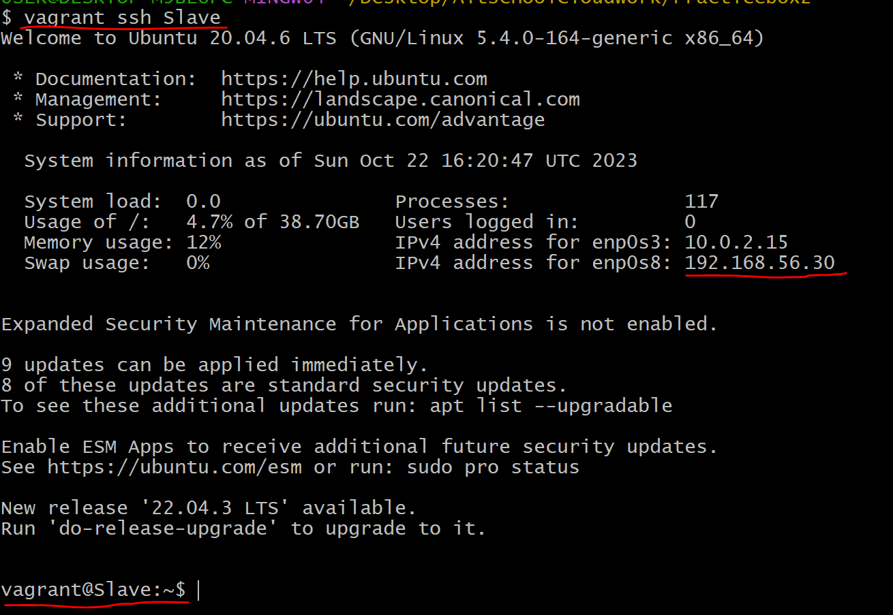

this is the process of copying the public key generated from Master into Slave to enable us 4ssh into slave:

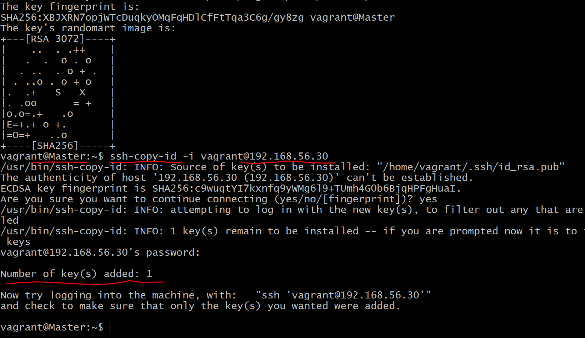

I was able to successfully ssh from Master to Slave

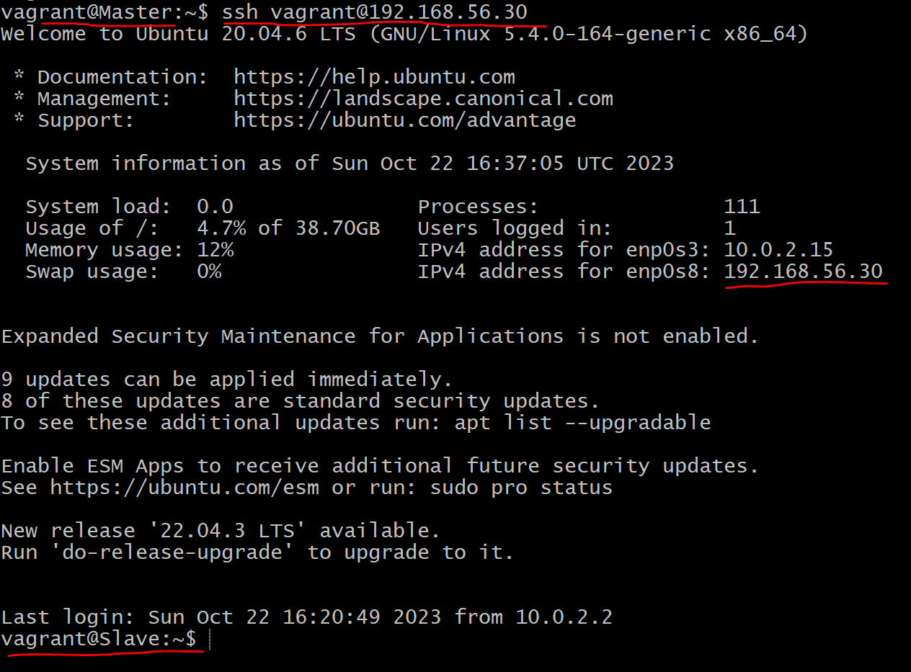

Now, after the creation of the bash script, i then created an ansible playbook to run the script on Slave machine. The next three images shows successful deployment of the script on Slave

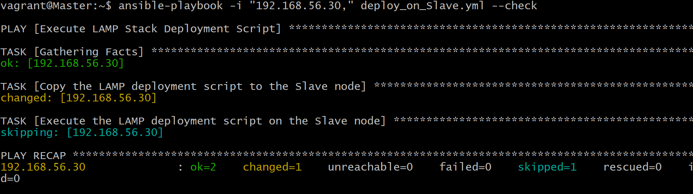

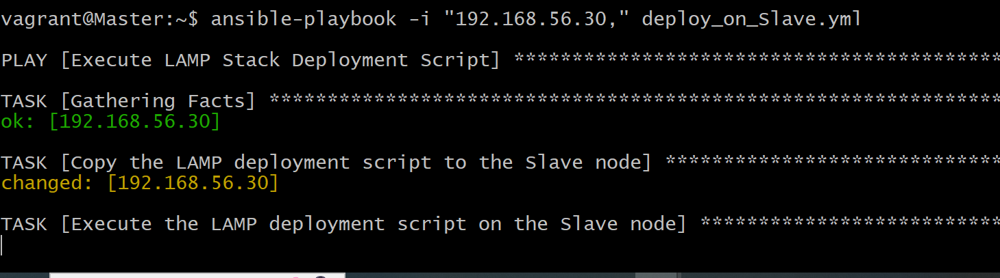

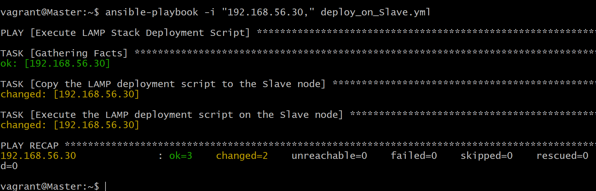

After the playbook had been executed, i checked to see if necessary applications had been installed on the Slave machine:

1. Check if Apaches2 is running and active:

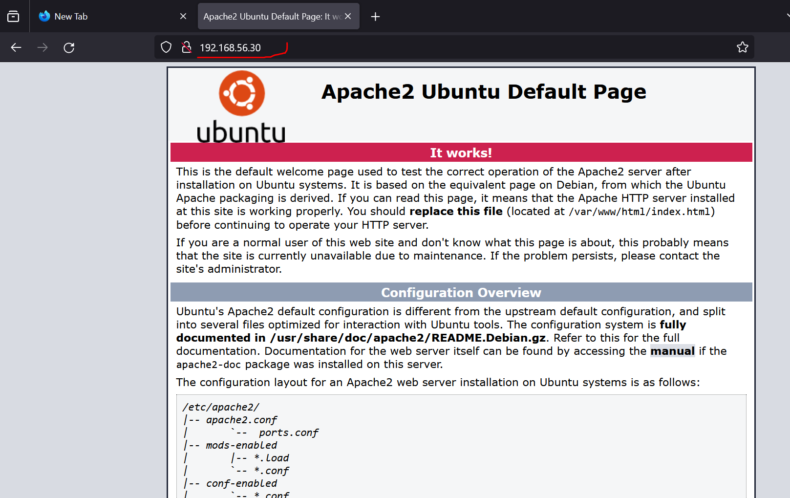

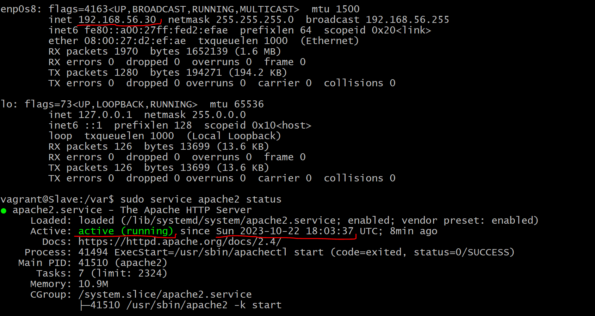

2. Check if mysql is installed on Slave machine:

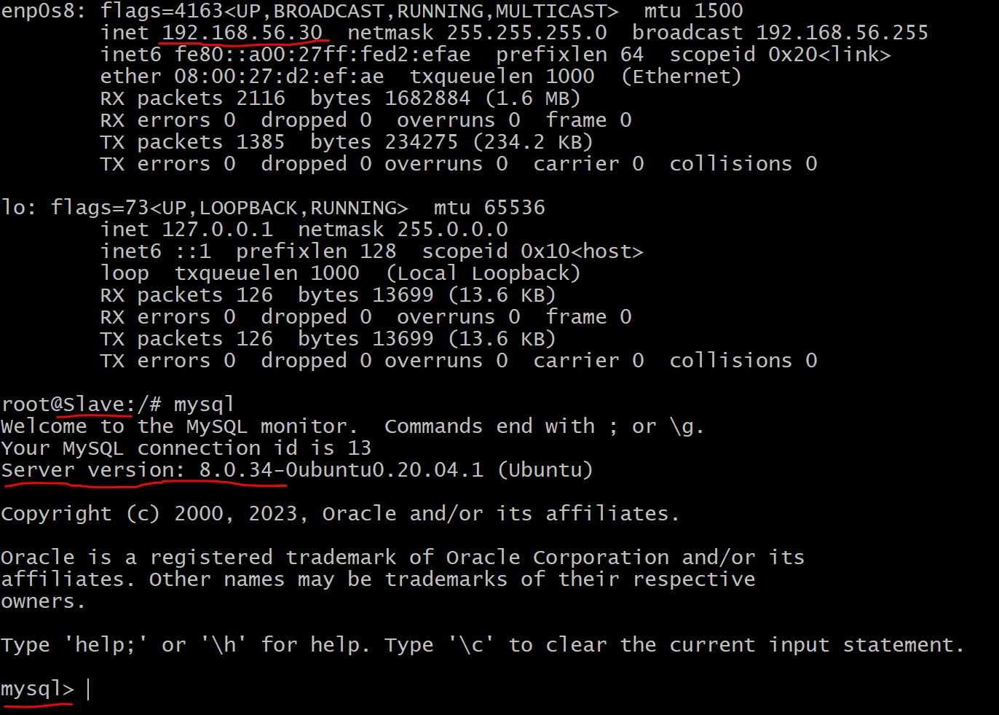

3. Check php accessibility on Slave:

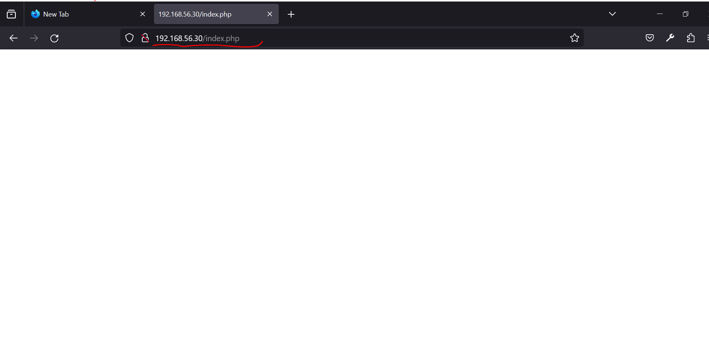

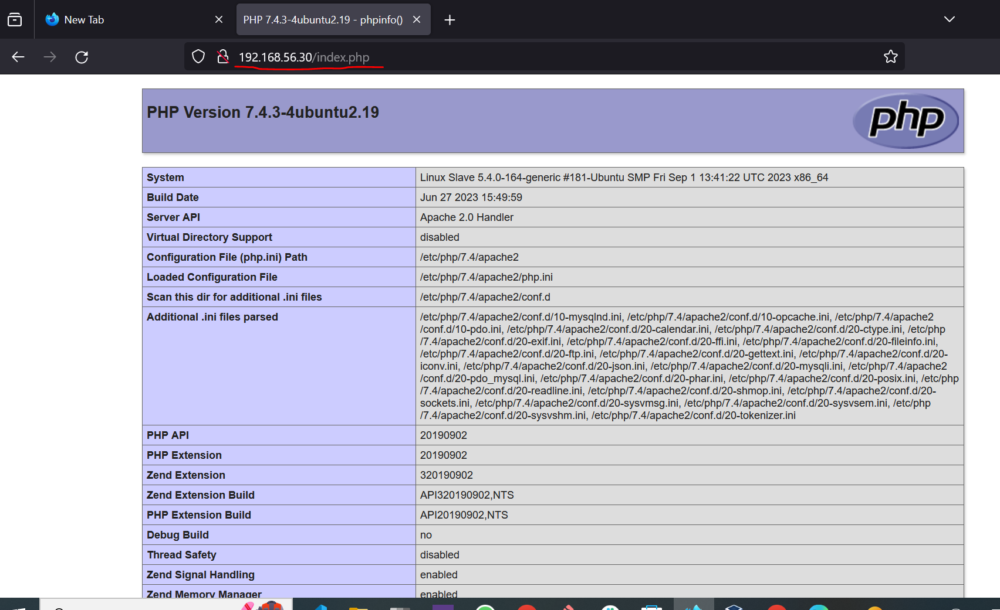

Cronjob was created to check the uptime of the Slave machine every 12am
I created the cronjob by executing the inbuilt uptime script found in /bin/uptime and i then created a log file named uptime.log in the /var/log/ directory. S3wo the script was set to run every 12am and the output is to be stored in my uptime.log file.

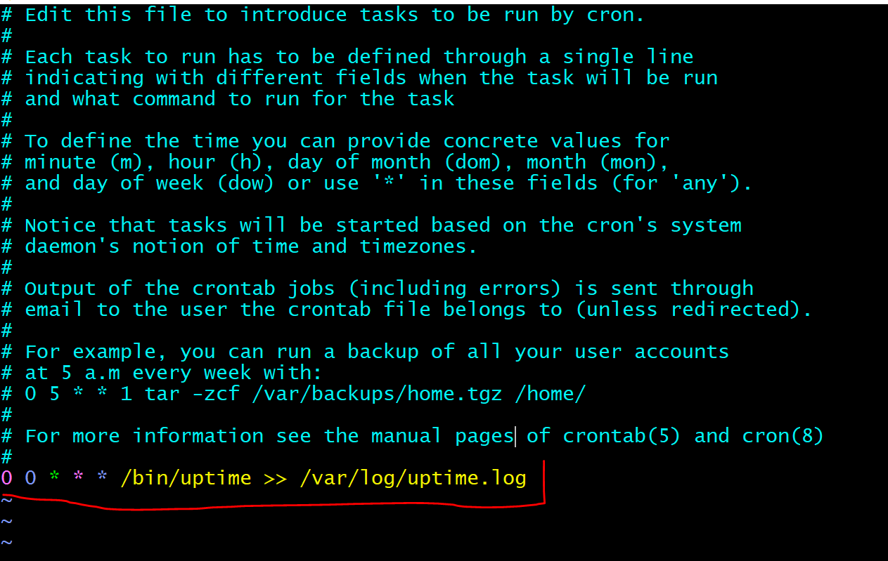

In mysql configuration, i created an ansible vault to keep my password encrypted

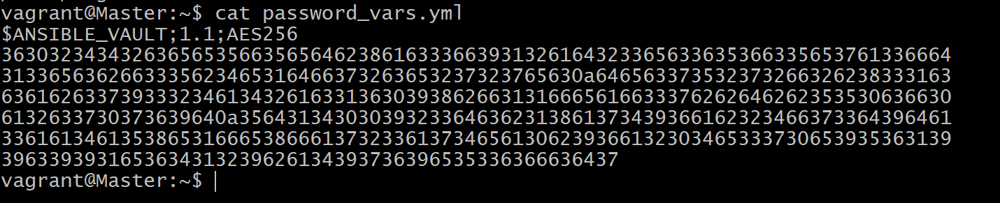

I also ran my bash script on Master and i checked if Apache is running:

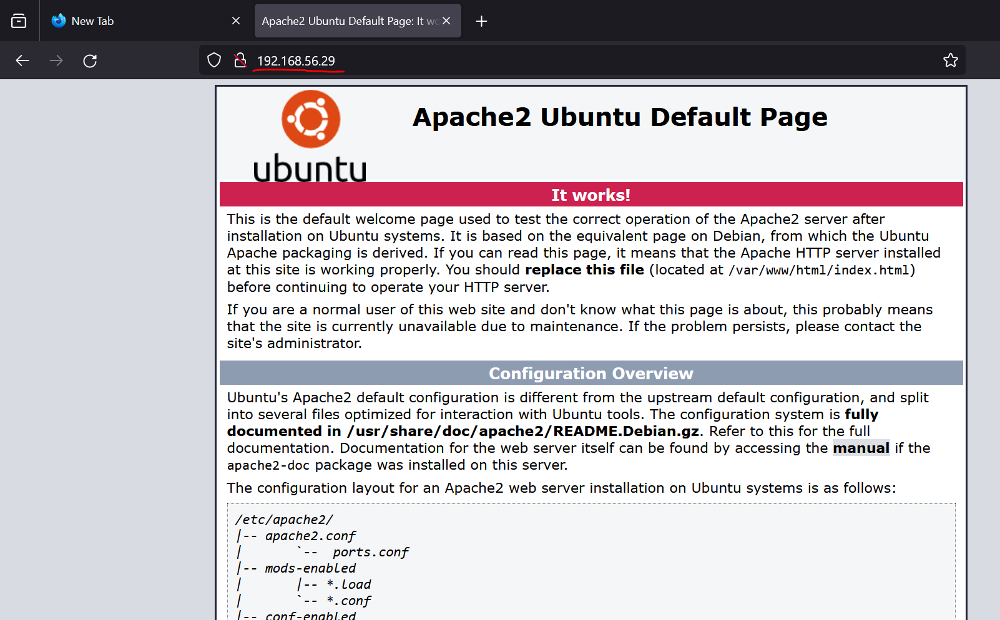

